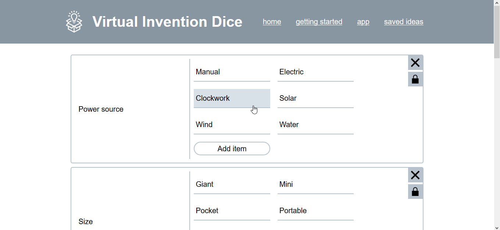

= virtual-invention-dice
Inspired from Atomic Shrimp's invention cube. Also serves as a simpler exercise for integrating PWA. For more information about the inspiration, you can read more about it in http://atomicshrimp.com/post/2014/01/20/Invention-Dice[this link]. There's also a video from the creator of this idea which you can see it https://www.youtube.com/watch?v=NBdVpiWUKhU[right here].

== Demo

== Features of the app
* Defining your own set of virtual idea dice set (or VIDS, as I call them)
* Storing VIDS in IndexedDB (with https://localforage.github.io/localForage/[localforage])
* Import and export of VIDS with a JSON file
* Saving dice results in IndexedDB (with https://localforage.github.io/localForage/[localforage])

== Development build
If you want to open this app locally on your machine, just do the following:

* clone this repo or download the zip of this repo provided
* install all of the dependencies needed (`npm i`)
* open the app over `localhost` with `npm run serve`

Voila! It's open now! 😁

If you want to contribute or just add features that you want, take note of the following configurations:

* created with https://cli.vuejs.org/guide/[Vue CLI] and the https://router.vuejs.org/[official Vue router library]
* uses http://tailwindcss.com/[Tailwind CSS] for most of the CSS
* uses https://github.com/eslint/eslint[ESLint] and it has the https://github.com/standard/standard[standard style guide] as the configuration
* all of the usual configurations and constants like the routes, app information, and the author are located in file:./src/appConstants.js[`./src/constants.js`], I've made it so that I can update it easily in one place

Also, for future references:

* Node v11.3.0
* npm 6.4.1

== Todo
* Multiple virtual idea dice set (VIDS) support

* A VIDS ranking system (see https://github.com/foo-dogsquared/virtual-idea-dice/issues/7[this issue])
-- This is mostly be implemented as an optional feature since the app is built to be offline.